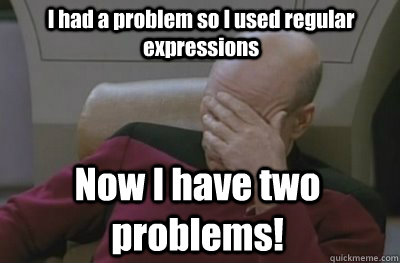

# Regular Expression

A regular expression, commonly called a “regexp”, is a sequence of characters that define a search pattern.  It is mainly for use in pattern matching with strings, or string matching (i.e. it operates like a “find and replace” command). While it is a very powerful tool, it is also very dangerous because of its complexity.

**_[Some people, when confronted with a problem, think](https://regex.info/blog/2006-09-15/247 "Some people, when confronted with a problem, think")_ _[“I know, I’ll use regular expressions.”   Now they have two problems.](https://regex.info/blog/2006-09-15/247 "“I know, I'll use regular expressions.”   Now they have two problems.")_** (super classic joke in the industry)

One thing you have to be careful with is that different languages use different regexp engines. That means that a regexp in Python, for example, will be interpreted differently in Javascript:

Regular expressions are everywhere and software engineers, no matter their positions, will have to use them during their careers. System administrators and DevOps are the ones using them the most because they are very handy for log parsing.

Read about regexp:

-   [http://www.regular-expressions.info/](https://www.regular-expressions.info/ "http://www.regular-expressions.info/")
-   [http://www.w3schools.com/jsref/jsref\_obj\_regexp.asp](https://www.w3schools.com/jsref/jsref_obj_regexp.asp "http://www.w3schools.com/jsref/jsref_obj_regexp.asp") Play with regexp (or compose them):
    
-   Ruby: [http://rubular.com/](https://rubular.com/ "http://rubular.com/")
    
-   PHP/Javascript/Python: [https://regex101.com/](https://regex101.com/ "https://regex101.com/")
